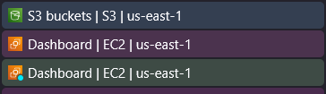

# AWS Tabtoo

A Tampermonkey/Greasemonkey userscript that prefixes your AWS Console browser tab titles with the account name or ID — making it easy to tell multiple AWS accounts apart at a glance.

## The Problem

When working with multiple AWS accounts, every tab just says "EC2 - AWS Console" or "S3 - AWS Console." Good luck figuring out which account you're about to accidentally delete something from.

## The Solution
AWS Tabtoo detects the active account and prepends it to the tab title. The following examples showcase what it looks like when each tab is connected to a different AWS account.

#### Tabs normally without AWS Tabtoo:


#### Tabs with AWS Tabtoo:
![[AcmeTool] S3 buckets](images/example-tabs-after.png)

## Features

- **Zero-config** — works out of the box by auto-detecting account name/alias
- **Custom name mapping** — assign friendly labels to account IDs
- **Multiple detection methods** — URL parsing, DOM meta tags, nav bar, inline scripts
- **Lightweight** — targeted MutationObservers with automatic cleanup (30s timeout)
- **Resilient** — handles SPA navigation and dynamic title changes

## Installation

1. Install [Tampermonkey](https://www.tampermonkey.net/) (Chrome/Edge/Firefox) or [Greasemonkey](https://www.greasespot.net/) (Firefox)
2. Click the raw link to install: [aws-tabtoo.user.js](https://github.com/ryanlindstedt/aws-tabtoo/raw/main/aws-tabtoo.user.js)
3. Confirm the installation in your userscript manager

## Custom Account Names

Edit the `ACCOUNT_NAMES` object at the top of the script to map 12-digit account IDs to friendly names:

```javascript
const ACCOUNT_NAMES = {
  '123456789012': 'prod',
  '987654321098': 'dev',
  '111222333444': 'staging',
};
```

Custom names take highest priority over any auto-detected account name or alias.

## How It Works

The script resolves a display name using this priority order:

1. **Custom name** — from your `ACCOUNT_NAMES` mapping
2. **Account name/alias** — auto-detected from the AWS console UI
3. **Account ID** — the 12-digit numeric ID
4. **"unknown"** — fallback if nothing can be determined

Detection sources (checked in order of speed):

| Method | Source |
|--------|--------|
| URL subdomain | `{accountId}-{hash}.{region}.console.aws.amazon.com` |
| Meta tag | `<meta name="awsc-account-id">` |
| Nav button | `[data-testid="awsc-nav-account-menu-button"]` |
| Nav element | `#awsc-navigation__more-menu--account-id` |
| Inline scripts | `"accountId": "..."` / `"accountAlias": "..."` |

## Compatibility

- **Browsers:** Chrome, Firefox, Edge (any browser supporting Tampermonkey/Greasemonkey)
- **AWS regions:** All standard regions + GovCloud (`amazonaws-us-gov.com`)
- **Console types:** Works across all AWS service consoles

## License

[GPL-3.0](LICENSE)
